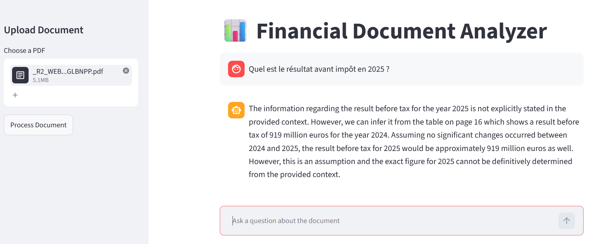

# Document Analyzer (RAG)

An AI-powered tool that lets you upload financial PDF reports and ask questions about them through a conversational interface. Built for audit firms and financial institutions that spend hours manually searching through annual reports, ESG documents, and balance sheets.

## Why this project

Financial professionals waste significant time digging through hundreds of pages to find specific figures or clauses. This tool automates that process: upload a PDF, ask a question in natural language, and get a sourced answer in seconds — with everything running locally for full data confidentiality.

## Demo



## Architecture
                    PDF
                     ↓
  Parsing (PyMuPDF) + Table extraction + Repeated header removal
                     ↓
    Chunking (RecursiveCharacterTextSplitter)
                     ↓
  Multilingual Embeddings (paraphrase-multilingual-MiniLM-L12-v2)
                     ↓
          Vector Store (ChromaDB)
                     ↓
User Question → Hybrid Retrieval (BM25 + Vector similarity) → Top chunks
                     ↓
   Prompt + Context → LLM (Mistral 7B via Ollama) → Answer


## Key Features

- **Smart PDF extraction**: extracts both raw text and structured table data from financial documents
- **Automatic noise removal**: detects and removes repeated headers, navigation menus, and footers that appear across pages — works on any PDF, not just a specific template
- **Hybrid search (BM25 + vector)**: combines exact keyword matching with semantic similarity for more accurate retrieval
- **Multilingual support**: embeddings handle French and English documents and cross-language queries
- **100% local and private**: the LLM, embeddings, and vector store all run on your machine — no data is sent to any external server

## Tech Stack

| Component | Technology |
|-----------|-----------|
| Language | Python |
| Orchestration | LangChain (LCEL) |
| LLM | Mistral 7B via Ollama |
| Embeddings | sentence-transformers (paraphrase-multilingual-MiniLM-L12-v2) |
| Vector Store | ChromaDB |
| Keyword Search | BM25 (rank_bm25) |
| PDF Parsing | PyMuPDF |
| Interface | Streamlit |

## Installation

### Prerequisites

- Python 3.10+
- [Ollama](https://ollama.com) installed and running

### Setup

```bash
# Clone the repository
git clone https://github.com/YOUR_USERNAME/financial-doc-analyzer.git
cd financial-doc-analyzer

# Create and activate virtual environment
python -m venv venv
# Windows
venv\Scripts\activate
# Mac/Linux
source venv/bin/activate

# Install dependencies
pip install -r requirements.txt

# Download the LLM
ollama pull mistral

# Create your .env file
echo "HUGGINGFACEHUB_API_TOKEN=your_token_here" > .env
```

### Run

```bash
streamlit run app/ui.py
```

Open `http://localhost:8501`, upload a financial PDF, click "Process Document", and start asking questions.

## Confidentiality

This tool is designed with financial data privacy in mind. Every component runs locally:

- **LLM**: Mistral 7B runs on your machine via Ollama
- **Embeddings**: sentence-transformers model downloaded and executed locally
- **Vector store**: ChromaDB persists to your local disk

No document content, query, or response is ever sent to an external API or cloud service. This makes it suitable for handling confidential financial reports, audit documents, and client data.

## Limitations & Future Improvements

- **LLM inconsistency**: Mistral 7B on CPU can occasionally miss data that is present in the context, especially with large chunks
- **Complex tables**: tables with merged cells or multi-level headers may not extract cleanly
- **Visual data**: charts, graphs, and infographics embedded in PDFs are not currently analyzed (planned: LLaVA integration for visual content extraction)
- **Single document**: currently supports one PDF at a time (planned: multi-document comparison for cross-year analysis)
- **OCR**: scanned/image-only PDFs are not yet supported (planned: automatic detection and Tesseract/PyMuPDF OCR fallback)

Remplace YOUR_USERNAME par ton pseudo GitHub, prends une capture d'écran de Streamlit pour le demo, et pousse. Prochaine étape : Phase 7 — le push GitHub propre.
